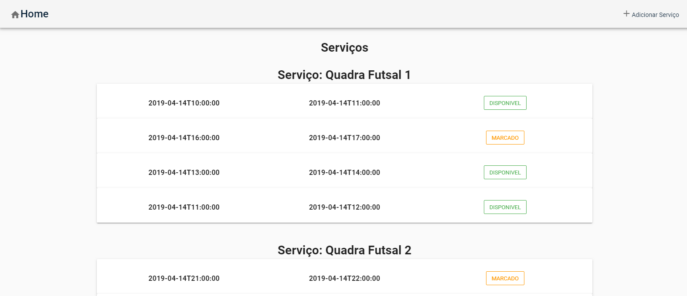
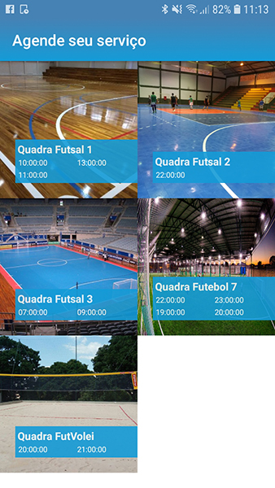
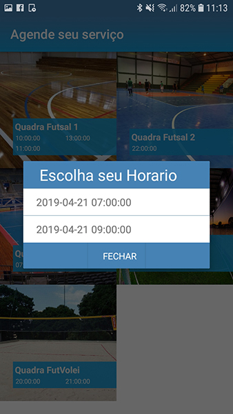

# pmcheck

> A native application built with NativeScript-Vue

## Usage

``` bash
# Install dependencies
npm install

# Build for production
tns build <platform> --bundle

# Build, watch for changes and debug the application
tns debug <platform> --bundle

# Build, watch for changes and run the application
tns run <platform> --bundle

-----------------------------------------------------------------------------------------

# pwagenda

## Project setup
```
yarn install
```

### Compiles and hot-reloads for development
```
yarn run serve
```

### Compiles and minifies for production
```
yarn run build
```

### Run your tests
```
yarn run test
```

### Lints and fixes files
```
yarn run lint
```

### Customize configuration
See [Configuration Reference](https://cli.vuejs.org/config/).
